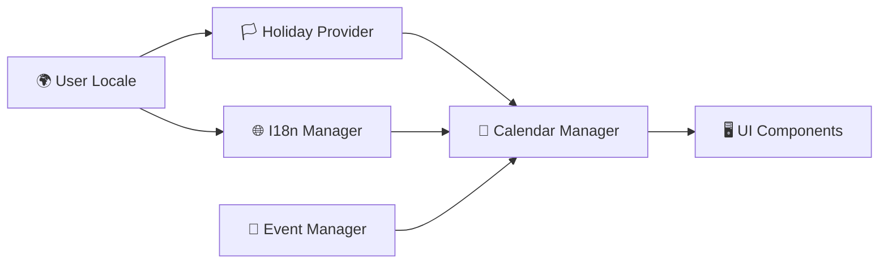

#  Calendifier

**Author: Oliver Ernster**

<!-- Multi-language summary -->
**🇺🇸 English (US):** Cross-platform desktop calendar and Home Assistant integration with analog clock, event handling, note taking, and holidays. If you like it please buy me a coffee: [Donation link](https://www.paypal.com/ncp/payment/Z36XJEEA4MNV6)

**🇬🇧 English (UK):** Cross-platform desktop calendar and Home Assistant integration with analogue clock, event handling, note taking, and holidays. If you like it please buy me a coffee: [Donation link](https://www.paypal.com/ncp/payment/Z36XJEEA4MNV6)

**🇸🇦 العربية:** تقويم سطح المكتب متعدد المنصات وتكامل مساعد المنزل مع ساعة تناظرية ومعالجة الأحداث وتدوين الملاحظات والعطلات. إذا أعجبك، يرجى شراء قهوة لي: [رابط التبرع](https://www.paypal.com/ncp/payment/Z36XJEEA4MNV6)

**🇧🇬 Български:** Кроссплатформен десктоп календар и интеграция с Домашен Асистент с аналогов часовник, управление на събития, бележки и празници. Ако ви харесва, моля купете ми кафе: [Линк за дарение](https://www.paypal.com/ncp/payment/Z36XJEEA4MNV6)

**🇪🇸 Català:** Calendari d'escriptori multiplataforma i integració d'Assistent Domèstic amb rellotge analògic, gestió d'esdeveniments, presa de notes i festius. Si t'agrada, si us plau compra'm un cafè: [Enllaç de donació](https://www.paypal.com/ncp/payment/Z36XJEEA4MNV6)

**🇨🇿 Čeština:** Multiplatformní desktopový kalendář a integrace Domácího Asistenta s analogovými hodinami, správou událostí, psaním poznámek a svátky. Pokud se vám líbí, kupte mi prosím kávu: [Odkaz na darování](https://www.paypal.com/ncp/payment/Z36XJEEA4MNV6)

**🇩🇰 Dansk:** Tværplatform skrivebordskalender og Hjemmeassistent-integration med analogt ur, begivenhedshåndtering, notetagning og helligdage. Hvis du kan lide det, så køb mig en kaffe: [Donationslink](https://www.paypal.com/ncp/payment/Z36XJEEA4MNV6)

**🇩🇪 Deutsch:** Plattformübergreifender Desktop-Kalender und Home Assistant-Integration mit analoger Uhr, Ereignisbehandlung, Notizen und Feiertagen. Wenn es Ihnen gefällt, kaufen Sie mir bitte einen Kaffee: [Spendenlink](https://www.paypal.com/ncp/payment/Z36XJEEA4MNV6)

**🇬🇷 Ελληνικά:** Πολυπλατφορμικό ημερολόγιο επιφάνειας εργασίας και ενσωμάτωση Οικιακού Βοηθού με αναλογικό ρολόι, διαχείριση συμβάντων, σημειώσεις και αργίες. Αν σας αρέσει, παρακαλώ αγοράστε μου έναν καφέ: [Σύνδεσμος δωρεάς](https://www.paypal.com/ncp/payment/Z36XJEEA4MNV6)

**🇪🇸 Español:** Calendario de escritorio multiplataforma e integración de Asistente del Hogar con reloj analógico, gestión de eventos, toma de notas y días festivos. Si te gusta, por favor cómprame un café: [Enlace de donación](https://www.paypal.com/ncp/payment/Z36XJEEA4MNV6)

**🇪🇪 Eesti:** Platvormideülene töölauakalender ja Kodu Assistendi integratsioon analoogkella, sündmuste käsitlemise, märkmete tegemise ja pühade funktsioonidega. Kui see meeldib, palun osta mulle kohv: [Annetuse link](https://www.paypal.com/ncp/payment/Z36XJEEA4MNV6)

**🇫🇮 Suomi:** Monialustainen työpöytäkalenteri ja Kotiavustaja-integraatio analogisella kellolla, tapahtumien käsittelyllä, muistiinpanoilla ja juhlapäivillä. Jos pidät siitä, osta minulle kahvi: [Lahjoituslinkki](https://www.paypal.com/ncp/payment/Z36XJEEA4MNV6)

**🇫🇷 Français:** Calendrier de bureau multiplateforme et intégration Assistant Domestique avec horloge analogique, gestion d'événements, prise de notes et jours fériés. Si vous l'aimez, achetez-moi un café s'il vous plaît: [Lien de don](https://www.paypal.com/ncp/payment/Z36XJEEA4MNV6)

**🇨🇦 Français (Québec):** Calendrier de bureau multiplateforme et intégration Assistant Domestique avec horloge analogique, gestion d'événements, prise de notes et jours fériés. Si vous l'aimez, achetez-moi un café s'il vous plaît: [Lien de don](https://www.paypal.com/ncp/payment/Z36XJEEA4MNV6)

**🇮🇱 עברית:** לוח שנה שולחני חוצה פלטפורמות ואינטגרציה עם עוזר בית עם שעון אנלוגי, טיפול באירועים, רישום הערות וחגים. אם אתם אוהבים את זה, אנא קנו לי קפה: [קישור לתרומה](https://www.paypal.com/ncp/payment/Z36XJEEA4MNV6)

**🇮🇳 हिन्दी:** एनालॉग घड़ी, इवेंट हैंडलिंग, नोट लेने और छुट्टियों के साथ क्रॉस-प्लेटफॉर्म डेस्कटॉप कैलेंडर और होम असिस्टेंट एकीकरण। यदि आपको यह पसंद है, तो कृपया मुझे एक कॉफी खरीदें: [दान लिंक](https://www.paypal.com/ncp/payment/Z36XJEEA4MNV6)

**🇭🇷 Hrvatski:** Višeplatformski desktop kalendar i integracija Kućnog Asistenta s analognim satom, upravljanjem događaja, bilježenjem i blagdanima. Ako vam se sviđa, molimo kupite mi kavu: [Link za donaciju](https://www.paypal.com/ncp/payment/Z36XJEEA4MNV6)

**🇭🇺 Magyar:** Többplatformos asztali naptár és Otthoni Asszisztens integráció analóg órával, eseménykezeléssel, jegyzetelésssel és ünnepekkel. Ha tetszik, kérem vegyenek nekem egy kávét: [Adományozási link](https://www.paypal.com/ncp/payment/Z36XJEEA4MNV6)

**🇮🇩 Bahasa Indonesia:** Kalender desktop lintas platform dan integrasi Asisten Rumah dengan jam analog, penanganan acara, pencatatan dan hari libur. Jika Anda menyukainya, tolong belikan saya kopi: [Link donasi](https://www.paypal.com/ncp/payment/Z36XJEEA4MNV6)

**🇮🇹 Italiano:** Calendario desktop multipiattaforma e integrazione Assistente Domestico con orologio analogico, gestione eventi, presa di note e festività. Se ti piace, per favore comprami un caffè: [Link donazione](https://www.paypal.com/ncp/payment/Z36XJEEA4MNV6)

**🇯🇵 日本語:** アナログ時計、イベント処理、ノート取り、祝日機能を備えたクロスプラットフォームデスクトップカレンダーとホームアシスタント統合。気に入ったら、コーヒーを買ってください: [寄付リンク](https://www.paypal.com/ncp/payment/Z36XJEEA4MNV6)

**🇰🇷 한국어:** 아날로그 시계, 이벤트 처리, 메모 작성 및 휴일 기능을 갖춘 크로스 플랫폼 데스크톱 캘린더 및 홈 어시스턴트 통합. 마음에 드시면 커피 한 잔 사주세요: [기부 링크](https://www.paypal.com/ncp/payment/Z36XJEEA4MNV6)

**🇱🇹 Lietuvių:** Daugiaplatformis darbalaukio kalendorius ir Namų Asistento integracija su analoginiu laikrodžiu, įvykių tvarkymu, užrašais ir šventėmis. Jei jums patinka, prašau nupirkite man kavos: [Aukojimo nuoroda](https://www.paypal.com/ncp/payment/Z36XJEEA4MNV6)

**🇱🇻 Latviešu:** Daudplatformu darbvirsmas kalendārs un Mājas Asistenta integrācija ar analogu pulksteni, notikumu apstrādi, piezīmēm un svētkiem. Ja jums patīk, lūdzu nopērciet man kafiju: [Ziedojuma saite](https://www.paypal.com/ncp/payment/Z36XJEEA4MNV6)

**🇳🇴 Norsk:** Kryssplattform skrivebordskalender og Hjemmeassistent-integrasjon med analog klokke, hendelseshåndtering, notater og helligdager. Hvis du liker det, kjøp meg en kaffe: [Donasjonslenke](https://www.paypal.com/ncp/payment/Z36XJEEA4MNV6)

**🇳🇱 Nederlands:** Platformonafhankelijke desktopkalender en Thuisassistent-integratie met analoge klok, gebeurtenisbeheer, notities en feestdagen. Als je het leuk vindt, koop me dan een koffie: [Donatielink](https://www.paypal.com/ncp/payment/Z36XJEEA4MNV6)

**🇵🇱 Polski:** Wieloplatformowy kalendarz pulpitu i integracja Asystenta Domowego z zegarem analogowym, obsługą wydarzeń, notatkami i świętami. Jeśli ci się podoba, kup mi kawę: [Link do darowizny](https://www.paypal.com/ncp/payment/Z36XJEEA4MNV6)

**🇧🇷 Português (Brasil):** Calendário de desktop multiplataforma e integração Assistente Doméstico com relógio analógico, manipulação de eventos, anotações e feriados. Se você gosta, por favor me compre um café: [Link de doação](https://www.paypal.com/ncp/payment/Z36XJEEA4MNV6)

**🇵🇹 Português (Portugal):** Calendário de desktop multiplataforma e integração Assistente Doméstico com relógio analógico, gestão de eventos, notas e feriados. Se gosta, por favor compre-me um café: [Link de doação](https://www.paypal.com/ncp/payment/Z36XJEEA4MNV6)

**🇷🇴 Română:** Calendar desktop multiplatformă și integrare Asistent Casnic cu ceas analogic, gestionarea evenimentelor, luarea de notițe și sărbători. Dacă vă place, vă rog să-mi cumpărați o cafea: [Link donație](https://www.paypal.com/ncp/payment/Z36XJEEA4MNV6)

**🇷🇺 Русский:** Кроссплатформенный настольный календарь и интеграция Домашнего Помощника с аналоговыми часами, обработкой событий, заметками и праздниками. Если вам нравится, пожалуйста, купите мне кофе: [Ссылка для пожертвования](https://www.paypal.com/ncp/payment/Z36XJEEA4MNV6)

**🇸🇰 Slovenčina:** Multiplatformový desktopový kalendár a integrácia Domáceho Asistenta s analógovými hodinami, správou udalostí, písaním poznámok a sviatkami. Ak sa vám páči, kúpte mi prosím kávu: [Odkaz na darovanie](https://www.paypal.com/ncp/payment/Z36XJEEA4MNV6)

**🇸🇮 Slovenščina:** Večplatformni namizni koledar in integracija Domačega Pomočnika z analogno uro, upravljanjem dogodkov, zapisovanjem in prazniki. Če vam je všeč, mi prosim kupite kavo: [Povezava za donacijo](https://www.paypal.com/ncp/payment/Z36XJEEA4MNV6)

**🇸🇪 Svenska:** Plattformsoberoende skrivbordskalender och Hemassistent-integration med analog klocka, händelsehantering, anteckningar och helgdagar. Om du gillar det, köp mig en kaffe: [Donationslänk](https://www.paypal.com/ncp/payment/Z36XJEEA4MNV6)

**🇹🇭 ไทย:** ปฏิทินเดสก์ท็อปข้ามแพลตฟอร์มและการรวม Home Assistant ด้วยนาฬิกาแอนะล็อก การจัดการเหตุการณ์ การจดบันทึก และวันหยุด หากคุณชอบ กรุณาซื้อกาแฟให้ฉัน: [ลิงก์บริจาค](https://www.paypal.com/ncp/payment/Z36XJEEA4MNV6)

**🇹🇷 Türkçe:** Çapraz platform masaüstü takvimi ve analog saat, olay işleme, not alma ve tatillerle Ev Asistanı entegrasyonu. Beğendiyseniz, lütfen bana bir kahve alın: [Bağış bağlantısı](https://www.paypal.com/ncp/payment/Z36XJEEA4MNV6)

**🇺🇦 Українська:** Кросплатформний настільний календар та інтеграція Домашнього Помічника з аналоговим годинником, обробкою подій, нотатками та святами. Якщо вам подобається, будь ласка, купіть мені каву: [Посилання для пожертви](https://www.paypal.com/ncp/payment/Z36XJEEA4MNV6)

**🇻🇳 Tiếng Việt:** Lịch máy tính để bàn đa nền tảng và tích hợp Trợ lý Gia đình với đồng hồ kim, xử lý sự kiện, ghi chú và ngày lễ. Nếu bạn thích, hãy mua cho tôi một ly cà phê: [Liên kết quyên góp](https://www.paypal.com/ncp/payment/Z36XJEEA4MNV6)

**🇨🇳 简体中文:** 具有模拟时钟、事件处理、记笔记和节假日功能的跨平台桌面日历和家庭助手集成。如果您喜欢，请给我买杯咖啡: [捐赠链接](https://www.paypal.com/ncp/payment/Z36XJEEA4MNV6)

**🇹🇼 繁體中文:** 具有類比時鐘、事件處理、記筆記和節假日功能的跨平台桌面日曆和家庭助理整合。如果您喜歡，請給我買杯咖啡: [捐贈連結](https://www.paypal.com/ncp/payment/Z36XJEEA4MNV6)


---

## 🌟 Overview

**Calendifier** is a sophisticated calendar system available in two deployment modes:

1. **🖥️ Desktop Application** - Cross-platform desktop calendar built with Python and PySide6
2. **🏠 Home Assistant Integration** - Web-based dashboard cards for Home Assistant with beautiful UI

Both versions feature comprehensive internationalization supporting **40 languages** and **40 countries**, making it a truly global calendar solution.

### ✨ Key Features

- 📅 **Full Calendar Management** - Monthly view with intuitive navigation
- 🌍 **40-Language Support** - Complete localization with runtime language switching
- 🏳️ **40-Country Holiday Support** - Intelligent holiday detection with native translations
- 🕐 **Real-time Analog Clock** - NTP synchronization for accurate timekeeping
- 📝 **Comprehensive Event Management** - Create, edit, delete with categories and recurring events
- 🎨 **Dynamic Theming** - Dark/Light mode with instant switching
- 📝 **Integrated Notes** - Built-in note-taking functionality
- 📤📥 **Import/Export** - Support for iCalendar, CSV, and JSON formats
- ⚙️ **Extensive Configuration** - Customizable settings for all preferences

## 🌍 International Support

### 🗣️ Supported Languages
- **🇺🇸🇬🇧 English** (US & UK variants)
- **🇨🇦 Français (Québec)** (Quebec French)
- **🇪🇸 Català** (Catalan)
- **🇪🇸 Español** (Spanish)
- **🇫🇷 Français** (French)
- **🇩🇪 Deutsch** (German)
- **🇮🇹 Italiano** (Italian)
- **🇧🇷 Português** (Brazilian Portuguese)
- **🇵🇹 Português** (Portuguese)
- **🇷🇺 Русский** (Russian)
- **🇨🇳 简体中文** (Simplified Chinese)
- **🇹🇼 繁體中文** (Traditional Chinese)
- **🇯🇵 日本語** (Japanese)
- **🇰🇷 한국어** (Korean)
- **🇮🇳 हिन्दी** (Hindi)
- **🇸🇦 العربية** (Arabic)
- **🇨🇿 Čeština** (Czech)
- **🇸🇪 Svenska** (Swedish)
- **🇳🇴 Norsk** (Norwegian)
- **🇩🇰 Dansk** (Danish)
- **🇫🇮 Suomi** (Finnish)
- **🇳🇱 Nederlands** (Dutch)
- **🇵🇱 Polski** (Polish)
- **🇹🇷 Türkçe** (Turkish)
- **🇺🇦 Українська** (Ukrainian)
- **🇬🇷 Ελληνικά** (Greek)
- **🇮🇩 Bahasa Indonesia** (Indonesian)
- **🇻🇳 Tiếng Việt** (Vietnamese)
- **🇹🇭 ไทย** (Thai)
- **🇧🇬 Български** (Bulgarian)
- **🇸🇰 Slovenčina** (Slovak)
- **🇸🇮 Slovenščina** (Slovenian)
- **🇭🇷 Hrvatski** (Croatian)
- **🇭🇺 Magyar** (Hungarian)
- **🇷🇴 Română** (Romanian)
- **🇮🇱 עברית** (Hebrew)
- **🇪🇪 Eesti** (Estonian)
- **🇱🇻 Latviešu** (Latvian)
- **🇱🇹 Lietuvių** (Lithuanian)

### 🏳️ Holiday Support
The application automatically detects and displays holidays for 40 countries with intelligent cultural filtering:

| Country | Holidays | Cultural Filtering |
|---------|----------|-------------------|
| 🇺🇸 United States | Federal holidays | ✅ |
| 🇨🇦 Canada | Jours fériés / Holidays | ✅ |
| 🇬🇧 United Kingdom | Bank holidays | ✅ |
| 🇪🇸 Spain | National holidays | ✅ |
| 🇫🇷 France | Jours fériés | ✅ |
| 🇩🇪 Germany | Feiertage | ✅ |
| 🇮🇹 Italy | Giorni festivi | ✅ |
| 🇧🇷 Brazil | Feriados nacionais | ✅ |
| 🇵🇹 Portugal | Feriados nacionais | ✅ |
| 🇷🇺 Russia | Праздничные дни | ✅ |
| 🇨🇳 China | 法定节假日 | ✅ |
| 🇹🇼 Taiwan | 國定假日 | ✅ |
| 🇯🇵 Japan | 祝日 | ✅ |
| 🇰🇷 South Korea | 공휴일 | ✅ |
| 🇮🇳 India | राष्ट्रीय अवकाश | ✅ |
| 🇸🇦 Saudi Arabia | الأعياد الوطنية | ✅ |
| 🇨🇿 Czech Republic | Státní svátky | ✅ |
| 🇸🇪 Sweden | Helgdagar | ✅ |
| 🇳🇴 Norway | Helligdager | ✅ |
| 🇩🇰 Denmark | Helligdage | ✅ |
| 🇫🇮 Finland | Juhlapäivät | ✅ |
| 🇳🇱 Netherlands | Feestdagen | ✅ |
| 🇵🇱 Poland | Święta państwowe | ✅ |
| 🇹🇷 Turkey | Resmi tatiller | ✅ |
| 🇺🇦 Ukraine | Державні свята | ✅ |
| 🇬🇷 Greece | Εθνικές γιορτές | ✅ |
| 🇮🇩 Indonesia | Hari libur nasional | ✅ |
| 🇻🇳 Vietnam | Ngày lễ quốc gia | ✅ |
| 🇹🇭 Thailand | วันหยุดราชการ | ✅ |
| 🇧🇬 Bulgaria | Национални празници | ✅ |
| 🇸🇰 Slovakia | Štátne sviatky | ✅ |
| 🇸🇮 Slovenia | Državni prazniki | ✅ |
| 🇭🇷 Croatia | Državni blagdani | ✅ |
| 🇭🇺 Hungary | Nemzeti ünnepek | ✅ |
| 🇷🇴 Romania | Sărbători naționale | ✅ |
| 🇮🇱 Israel | חגים לאומיים | ✅ |
| 🇪🇪 Estonia | Riigipühad | ✅ |
| 🇱🇻 Latvia | Valsts svētki | ✅ |
| 🇱🇹 Lithuania | Valstybės šventės | ✅ |

## Screen shot


# Home Assistant


## 🚀 Quick Start

Choose your preferred deployment method:

## 🏠 Home Assistant Deployment (Recommended)

Deploy Calendifier as beautiful dashboard cards in Home Assistant for web-based access.

### 📋 Prerequisites
- **Home Assistant** installed and running ([Setup Guide](https://www.home-assistant.io/))
- **Raspberry Pi** or **Linux server** with Docker
- **SSH access** to your server
- **Windows PC or Mac or Linux box** for deployment script

### 🔧 Home Assistant Installation

1. **Clone the repository:**
   ```
   git clone https://github.com/oernster/calendifier.git
   cd calendifier
   ```

2. **Deploy to your Pi/Server:**
   ```powershell
   .\deploy-ha.ps1
   ```
   **or for linux/mac:**
   ```sh
   ./deploy-ha.sh
   ```
   Enter your Pi's IP address when prompted.

3. **Note on tarball extraction:**
   The deployment script creates a tarball that, when extracted on your Pi, will initially create numerous files in the working directory. This temporary file distribution is intentional and will be completely resolved when you execute the setup script in the following step.

4. **SSH to your Pi and run setup:**
   ```bash
   ssh pi@your-pi-ip
   ./setup-pi.sh
   ```

5. **Access your calendar:**
   - Open Home Assistant: `http://your-pi-ip:8123`
   - Complete [Home Assistant setup wizard](https://www.home-assistant.io/)
   - Click **"Calendifier"** in the left sidebar
   - Enjoy your beautiful calendar dashboard!

### ✨ Home Assistant Features
- 🎨 **Beautiful Dashboard Cards** - Clock, Calendar, Events, Notes, Settings, Data Management
- 📱 **Responsive Design** - Works on desktop, tablet, and mobile
- 🌐 **Web Access** - Access from anywhere on your network
- 🔄 **Auto-Updates** - Cards refresh automatically
- 🎯 **Optimized Layout** - No overlapping, proper spacing

---

## 🖥️ Desktop Application

Traditional desktop application for local use.

### 📋 Prerequisites

- **Python 3.8+**
- **PySide6** (Qt6 for Python)
- **Windows 10+**, **macOS 10.14+**, or **Linux** (Ubuntu 18.04+)

### 🔧 Desktop Installation

1. **Clone the repository:**
   ```bash
   git clone https://github.com/oernster/calendifier.git
   cd calendifier
   ```

2. **Install dependencies:**
   ```bash
   pip install -r requirements.txt
   ```

3. **Run the application:**
   ```bash
   python main.py
   ```

### 🎯 First Launch

On first launch, the application will:
- 🔍 **Auto-detect your system locale** and set the appropriate language
- 🏳️ **Match your country** to display relevant holidays
- 🎨 **Apply your system theme** (dark/light mode)
- 📁 **Create user data directory** at `~/.calendar_app/`

## 📱 Screenshots

### 🌙 Dark Theme


### ☀️ Light Theme


### 🌍 Language Switching


### 📝 Event Management


## 🏗️ Architecture

This application features a sophisticated modular architecture with emphasis on internationalization and cultural awareness. For detailed technical documentation, see **[📖 Architecture Documentation](docs/architecture.md)** and the [📚 Documentation](#-documentation) section for additional specialized documentation files.

### 🧩 Key Components

- **🌍 I18n Manager** - Advanced internationalization with runtime language switching
- **🏳️ Holiday Provider** - Multi-country holiday system with cultural filtering
- **📅 Calendar Manager** - Calendar logic with event and holiday integration
- **📝 Event Manager** - Full CRUD operations with recurring event support
- **🎨 Theme Manager** - Dynamic theming system
- **🗄️ Database Manager** - SQLite with schema versioning

### 🔄 Data Flow


```mermaid
graph LR
    A[🌍 User Locale] --> B[🏳️ Holiday Provider]
    A --> C[🌐 I18n Manager]
    B --> D[📅 Calendar Manager]
    C --> D
    E[📝 Event Manager] --> D
    D --> F[🖥️ UI Components]
```

## 🛠️ Development

### 🏃‍♂️ Running from Source

```bash
# Clone repository
git clone https://github.com/oernster/calendifier.git
cd calendifier

# Create virtual environment
python -m venv venv
source venv/bin/activate  # On Windows: venv\Scripts\activate

# Install dependencies
pip install -r requirements.txt

# Run application
python main.py
```

### 🌍 Adding New Languages

1. Create translation file: `calendar_app/localization/translations/{locale}.json`
2. Add holiday translations: `calendar_app/localization/locale_holiday_translations/{locale}_holidays.json`
3. Update supported locales in `LocaleDetector`
4. Test language switching functionality

See [Architecture Documentation](docs/architecture.md#-adding-new-languages) for detailed instructions.

## 🧪 Testing & Quality

Calendifier enforces a **100% test-coverage gate** over its core logic surface (version handling, data models, settings, locale detection, number formatting, the RRULE parser, the holiday providers and the observance engine and data). Tests use **real objects and real inputs only, no mocking**, and avoid fragile constructs. A structural test also keeps source modules within a 400-line limit.

```bash
python -m pytest                                    # core gate (100%)
python -m pytest tests/ui --no-cov -o addopts=""    # Qt/UI suite (not gated)
python -m black --check .                            # format
python -m flake8 .                                   # lint
```

See **[TESTING.md](TESTING.md)** for the full testing policy, the gated module list and how to extend it.

## 📦 Building & Distribution

Calendifier is packaged with **PyInstaller** on every platform, using a consistent set of repo-root build scripts. The version is read from the single source of truth, the [`VERSION`](VERSION) file. For full environment setup and step-by-step instructions see **[DEVELOPMENT-README.md](DEVELOPMENT-README.md)**.

### 🪟 Windows (per-user installer)

```bash
python buildexe.py        # app bundle      -> dist-pyinstaller/Calendifier/
python buildinstaller.py  # payload + setup -> dist-installer/CalendifierSetup.exe
```

A bespoke, per-user installer (no admin rights) under `installer/` extracts to `%LOCALAPPDATA%\Programs\Calendifier`, registers an uninstall entry and offers Start Menu / Desktop shortcuts.

### 🍎 macOS (signed DMG)

```bash
python builddmg.py
```

Builds a code-signed `Calendifier.app`, packages it as `calendifier.dmg`, and notarizes/staples it when `APPLE_ID` and `APPLE_APP_PASSWORD` are set.

### 📦 Linux Flatpak Package

Build a universal Flatpak package for all Linux distributions using the bash script:

```bash
# Make the build script executable (on Linux)
chmod +x build_flatpak.sh

# Run the build script with automatic dependency installation
./build_flatpak.sh
```

**Output**: `.flatpak` bundle and repository in project directory

**Supported Distributions**:
- Debian/Ubuntu/Linux Mint/Pop!_OS
- Fedora/RHEL/CentOS/Rocky/AlmaLinux
- Arch Linux/EndeavourOS/Manjaro
- openSUSE (Leap/Tumbleweed)
- Void Linux

📖 **Detailed Instructions**: See [`FLATPAK_BUILD_README.md`](FLATPAK_BUILD_README.md)

**🔧 Build Script Features:**
- **Automatic Distribution Detection** - Detects your Linux distribution and configures accordingly
- **Desktop Environment Integration** - Optimizes for GNOME, KDE, Cinnamon, etc.
- **Dependency Management** - Automatically installs required Flatpak runtimes
- **Cross-Distribution Support** - Works on all major Linux distributions
- **Interactive Installation** - Prompts to install the built package automatically

### 🎨 Icons

All icon artifacts (the per-size PNG set, the Windows multi-resolution `.ico`, the macOS `.icns` and a scalable SVG) are generated from a single master image:

```bash
python generate_icons.py
```

### ⚖️ Licensing

Calendifier is distributed under **LGPL-3.0**, aligning with PySide6/Qt. The licence text ships with every installer and is shown in the installer UI.


## 📦 Project Structure

```
calendifier/
├── 📄 main.py                    # Application entry point
├── 📄 version.py                 # Version and metadata
├── 📄 requirements.txt           # Dependencies
├── 📁 calendar_app/              # Main application package
│   ├── 📁 core/                  # Business logic
│   │   ├── 📄 calendar_manager.py
│   │   ├── 📄 event_manager.py
│   │   └── 📄 multi_country_holiday_provider.py
│   ├── 📁 ui/                    # User interface
│   │   ├── 📄 main_window.py
│   │   ├── 📄 calendar_widget.py
│   │   └── 📄 clock_widget.py
│   ├── 📁 data/                  # Data layer
│   │   ├── 📄 database.py
│   │   └── 📄 models.py
│   ├── 📁 config/                # Configuration
│   │   ├── 📄 settings.py
│   │   └── 📄 themes.py
│   ├── 📁 localization/          # Internationalization
│   │   ├── 📄 i18n_manager.py
│   │   ├── 📁 translations/      # Translation files
│   │   └── 📁 locale_holiday_translations/
│   └── 📁 utils/                 # Utilities
├── 📁 assets/                    # Application assets
├── 📁 docs/                      # Documentation
│   └── 📄 architecture.md        # Technical architecture
└── 📁 tests/                     # Test suite
```

## 📚 Documentation

Calendifier includes comprehensive documentation in the `docs/` directory:

| Document | Description |
|----------|-------------|
| [Development & Build Guide](DEVELOPMENT-README.md) | Environment setup and per-platform build instructions |
| [Testing & Quality](TESTING.md) | The 100% coverage gate, how to run it and how to extend it |
| [Architecture Overview](docs/architecture.md) | Complete system architecture and component design |
| [API Server](docs/api-server.md) | API endpoints and server implementation details |
| **API Documentation** | Access the interactive API documentation at `http://your-server-ip:8000/docs` (Swagger UI) or `http://your-server-ip:8000/redoc` (ReDoc) |
| [Desktop Application Lifecycle](docs/desktop-application-lifecycle.md) | Desktop app initialization and execution flow |
| [Desktop UI Components](docs/desktop-ui-components.md) | Desktop UI widget implementation details |
| [Home Assistant Deployment](docs/home-assistant-deployment.md) | Home Assistant integration deployment guide |
| [RRule Implementation](docs/rrule-implementation.md) | Recurring event rule implementation details |
| [Translation System](docs/translation-system.md) | Internationalization and localization architecture |
| [Web Components](docs/web-components.md) | Home Assistant web component implementation |

## ⚙️ Configuration

### 🏠 User Data Location

The application stores user data in:
- **Windows:** `%USERPROFILE%\.calendar_app\`
- **macOS:** `~/.calendar_app/`
- **Linux:** `~/.calendar_app/`

### 📁 Configuration Files

- **`settings.json`** - Application preferences
- **`data/calendar.db`** - SQLite database
- **`logs/`** - Application logs
- **`exports/`** - Exported calendar files
- **`backups/`** - Database backups

### 🔈 Logging

The console shows only warnings and errors by default; full detail is written to `logs/calendar_app.log` under the user data directory. Set `CALENDIFIER_LOG_LEVEL=INFO` (or `DEBUG`) before launching to raise console verbosity.

## 🤝 Contributing

I welcome contributions! Please see the [Contributing Guidelines](CONTRIBUTING.md) for details.

### 🐛 Bug Reports

Please use the [GitHub Issues](https://github.com/oernster/calendifier/issues) page to report bugs. Include:
- Operating system and version
- Python version
- Steps to reproduce
- Expected vs actual behavior
- Screenshots if applicable

### 💡 Feature Requests

I'm always looking to improve! Submit feature requests via [GitHub Issues](https://github.com/oernster/calendifier/issues) with the "enhancement" label.

### 🌍 Translations

Help me support more languages! See [Adding New Languages](docs/architecture.md#-adding-new-languages) in the architecture documentation.

## 📄 License

This project is licensed under the MIT License - see the [LICENSE](LICENSE) file for details.

## 🙏 Acknowledgments

- **[PySide6](https://doc.qt.io/qtforpython/)** - Qt6 Python bindings
- **[Python holidays](https://python-holidays.readthedocs.io/)** - Holiday data library
- **[ntplib](https://pypi.org/project/ntplib/)** - NTP client library
- **[icalendar](https://icalendar.readthedocs.io/)** - iCalendar format support

## 📞 Support

- 📖 **Documentation:** [Complete Documentation](#-documentation) including [Architecture Guide](docs/architecture.md)
- 🐛 **Issues:** [GitHub Issues](https://github.com/oernster/calendifier/issues)
- 💬 **Discussions:** [GitHub Discussions](https://github.com/oernster/calendifier/discussions)

---

<div align="center">

**Made with ❤️ for the global community**

*Supporting 40 languages and 40 countries worldwide*

[🌍 View Architecture](docs/architecture.md) • [📚 Documentation](#-documentation) • [🚀 Quick Start](#-quick-start) • [🤝 Contributing](#-contributing)

</div>
